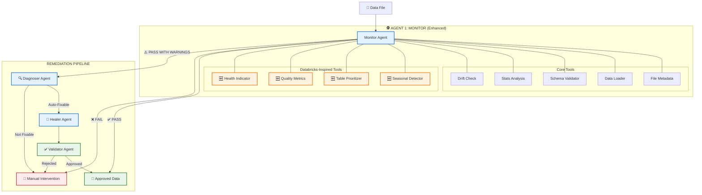

## 🆕 Databricks-Inspired Enhancements

Based on [Databricks' Agentic Data Quality Monitoring](https://www.databricks.com/blog/data-quality-monitoring-scale-agentic-ai), we've added:

### 1. Seasonal Detector
**Learned behavior, not static rules.**
- Learns day-of-week patterns (e.g., dips on weekends)
- Learns monthly patterns (e.g., tax season spikes)
- Adapts thresholds based on historical variance
- Distinguishes real anomalies from expected seasonal variation

### 2. Table Prioritizer
**Issues prioritized by downstream impact.**
- Tables ranked by certification level (Gold/Silver/Bronze)
- Downstream lineage tracking
- Query volume monitoring
- Freshness SLA enforcement
- High-impact tables are flagged first

### 3. Quality Metrics Tool
**Comprehensive data profiling.**
- **Freshness**: Is the data up-to-date?
- **Completeness**: How much data is missing?
- **Validity**: Does data conform to expected formats?
- **Uniqueness**: Are there unexpected duplicates?

### 4. Health Indicator
**Consistent health signals across the platform.**
- Unified health score (0-100)
- Clear "safe to use" indication
- Status badges for dashboards
- Schema-level health aggregation

## Monitor Agent: The Decision Tree

```
┌─────────────────────────────────────────────────────────────────────────────┐
│                      MONITOR AGENT DECISION TREE                             │
└─────────────────────────────────────────────────────────────────────────────┘

STEP 1: Sanity Check (FileMetadataTool)
├─ Check file freshness (< 24 hours?)
├─ Calculate MD5 hash (duplicate?)
└─ Get file size
   │
   ├─ ❌ STALE/DUPLICATE → STOP & ARCHIVE
   └─ ✅ FRESH → CONTINUE

STEP 2: Load & Sampling (DataLoaderTool)
├─ File > 500MB?
│  ├─ YES → Load 10% sample
│  └─ NO → Load full file
└─ Parse CSV/Parquet/JSON
   │
   ├─ ❌ LOAD FAILED → CRITICAL STOP
   └─ ✅ LOADED → CONTINUE

STEP 3: Schema Validation (SchemaValidatorTool)
├─ Compare against monitor_config.yaml
├─ Check for missing columns
├─ Check for extra columns
├─ Validate data types
└─ Check constraints (null%, unique, min/max)
   │
   ├─ ❌ CRITICAL VIOLATION → CRITICAL STOP
   ├─ ⚠️  WARNING VIOLATION → WARN & CONTINUE
   └─ ✅ PASS → CONTINUE

STEP 4: Statistical Profiling (StatsAnalysisTool)
├─ Calculate: mean, median, std, skewness, kurtosis
├─ Adaptive Outlier Detection:
│  ├─ Skewness < 1.0 → Z-Score method (threshold=3.0)
│  └─ Skewness ≥ 1.0 → IQR method (multiplier=1.5)
└─ Identify outlier indices
   │
   └─ ✅ PROFILED → CONTINUE

STEP 5: Drift Detection (DriftCheckTool)
├─ Query SQLite for 7-day historical baseline
├─ Compare current metrics vs baseline
│  ├─ Row count deviation
│  └─ Column mean deviation
└─ Check if deviation > 30%
   │
   ├─ ⚠️  DRIFT DETECTED → WARN & CONTINUE
   └─ ✅ NO DRIFT → CONTINUE

STEP 6: Final Verdict
├─ Aggregate all CRITICAL errors
├─ Aggregate all WARNINGS
├─ Collect quarantine indices (outliers)
└─ Generate JSON report
   │
   ├─ ❌ CRITICAL ERRORS → STATUS: FAIL
   ├─ ⚠️  WARNINGS → STATUS: PASS_WITH_WARNINGS
   └─ ✅ NO ISSUES → STATUS: PASS
```

## Tool Architecture

```
┌─────────────────────────────────────────────────────────────────────────────┐
│                          MONITOR AGENT TOOLS                                 │
└─────────────────────────────────────────────────────────────────────────────┘

tools/monitor/
│
├─ file_metadata_tool.py
│  ├─ Check file age (freshness)
│  ├─ Calculate MD5 hash (duplication)
│  ├─ Get file size
│  └─ Decision: CONTINUE or STOP
│
├─ data_loader_tool.py
│  ├─ Detect file type (CSV/Parquet/JSON)
│  ├─ Smart sampling (if > 500MB)
│  ├─ Load into pandas DataFrame
│  └─ Decision: CONTINUE or CRITICAL_STOP
│
├─ schema_validator_tool.py
│  ├─ Load YAML config
│  ├─ Check missing/extra columns
│  ├─ Validate data types
│  ├─ Check constraints (null%, unique, min/max)
│  └─ Decision: CONTINUE or CRITICAL_STOP
│
├─ stats_analysis_tool.py
│  ├─ Calculate statistics (mean, median, std, skew, kurt)
│  ├─ Adaptive outlier detection:
│  │  ├─ Normal distribution → Z-Score
│  │  └─ Skewed distribution → IQR
│  └─ Return outlier indices
│
└─ drift_check_tool.py
   ├─ Initialize SQLite database
   ├─ Query 7-day historical baseline
   ├─ Compare current vs baseline
   ├─ Calculate deviation percentage
   └─ Decision: WARN or PASS
```

## Data Flow

```
┌─────────────────────────────────────────────────────────────────────────────┐
│                              DATA FLOW                                       │
└─────────────────────────────────────────────────────────────────────────────┘

INPUT:
  ├─ File Path: data/transactions.csv
  ├─ Table Name: transactions
  └─ Config: config/monitor_config.yaml

PROCESSING:
  ├─ FileMetadataTool → { status, size_mb, hash, decision }
  ├─ DataLoaderTool → { dataframe, rows_loaded, columns, decision }
  ├─ SchemaValidatorTool → { violations[], decision }
  ├─ StatsAnalysisTool → { profiles{}, outlier_indices[] }
  └─ DriftCheckTool → { drift_warnings[], decision }

OUTPUT:
  └─ JSON Report:
     {
       "timestamp": "2026-02-05T...",
       "file": "data/transactions.csv",
       "status": "PASS_WITH_WARNINGS",
       "execution_time": "0.02s",
       "critical_errors": [],
       "warnings": ["Column 'category': null% = 5.5%"],
       "stats_summary": { ... },
       "quarantine_indices": [45, 92, 101, ...],
       "execution_log": [ ... ]
     }

STORAGE:
  ├─ SQLite: data/metrics_history.db (historical metrics)
  └─ JSON: reports/monitor_report_YYYYMMDD_HHMMSS.json
```

## YAML Configuration Structure

```
┌─────────────────────────────────────────────────────────────────────────────┐
│                       DATA CONTRACT (YAML)                                   │
└─────────────────────────────────────────────────────────────────────────────┘

monitor_config.yaml
│
├─ defaults:
│  ├─ freshness_hours: 24
│  ├─ sampling_threshold_mb: 500
│  ├─ drift_threshold_pct: 30
│  └─ lookback_days: 7
│
└─ columns:
   │
   ├─ CRITICAL Columns (Hard Stops):
   │  ├─ transaction_id (unique, no nulls)
   │  ├─ amount (min: 0.01, no nulls)
   │  └─ timestamp (no nulls)
   │
   └─ WARNING Columns (Soft Fails):
      ├─ user_id (max 10% nulls)
      ├─ user_comment (max 50% nulls)
      └─ category (max 5% nulls)
```

---

**Legend:**
- ✅ = Fully Implemented
- 📝 = Placeholder (Ready for Implementation)
- ❌ = Critical Stop
- ⚠️  = Warning (Continue)
# 🍌 System Architecture (Mermaid Diagram)

You can copy the code below into any Mermaid live editor (like [mermaid.live](https://mermaid.live/)) to generate a high-quality image.

```mermaid
graph TD
    %% Styling
    classDef monitor fill:#e3f2fd,stroke:#1565c0,stroke-width:2px,rx:10;
    classDef core fill:#bbdefb,stroke:#1976d2,stroke-width:1px,rx:5;
    classDef enhanced fill:#ffecb3,stroke:#ffa000,stroke-width:2px,rx:5;
    classDef output fill:#c8e6c9,stroke:#388e3c,stroke-width:2px,rx:5;
    classDef fail fill:#ffcdd2,stroke:#d32f2f,stroke-width:2px,rx:5;
    classDef future fill:#f5f5f5,stroke:#9e9e9e,stroke-width:1px,stroke-dasharray: 5 5,rx:5;

    %% Data Input
    Data([📄 Data File\nCSV/JSON/Parquet]) --> MonitorAgent

    %% Main Agent
    subgraph MonitorAgent ["🕵️ MONITOR AGENT (The Gatekeeper)"]
        direction TB
        
        subgraph Valid ["Phase 1: Validation"]
            T1[File Metadata]:::core
            T2[Data Loader]:::core
            T3[Schema Check]:::core
        end
        
        subgraph Intel ["Phase 2: Intelligence"]
            T4[Stats Analysis]:::core
            T5[Drift Check]:::core
            T6[🍌 Seasonal Detector]:::enhanced
        end
        
        subgraph Impact ["Phase 3: Impact Analysis"]
            T7[Quality Metrics]:::enhanced
            T8[Health Indicator]:::enhanced
            T9[Table Prioritizer]:::enhanced
        end
        
        Valid --> Intel --> Impact
    end

    %% Outputs
    Impact --> Decision{VERDICT}
    
    Decision -->|✅ PASS| Approved[💾 Approved Data\n(To Warehouse)]:::output
    Decision -->|❌ FAIL| ManAuth[🛑 Manual Authorization\nRequired]:::fail
    Decision -->|⚠️ WARN| Diagnoser
    
    %% Future Agents
    subgraph Remediation ["🤖 REMEDIATION PIPELINE (Future)"]
        Diagnoser[🔍 Diagnoser Agent]:::future -->|Analysis| Healer[🔧 Healer Agent]:::future
        Healer -->|Fixes| Validator[✅ Validator Agent]:::future
        Validator --> Approved
    end
    
    %% Legend links
    class MonitorAgent monitor;
```
