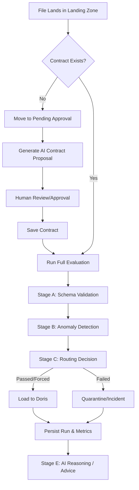

# Agentic Data Reliability Engineering (DRE) Platform

An agentic data reliability control plane for local-first and enterprise data workflows.

It validates incoming datasets against contracts, detects anomalies using statistical baselines, evaluates SLOs, and routes data through active/pending/quarantine flows with **Human-in-the-Loop (HITL)** and **Agentic Remediation** controls.

### Ingestion + Evaluation Flow



1. File lands in `data/landing`
2. File watcher resolves dataset name
3. Unified workflow dispatch:
   - If contract exists: run full evaluation pipeline
   - If no contract: move to `data/pending_approval`, generate proposal in `config/proposals`
4. On approval: save contract and validate pending files automatically
5. Persist runs, metrics, baselines, SLO checks, and verdict logs
6. Contract-missing path is durable via LangGraph interrupt/resume + PostgreSQL checkpointer

## Current Progress (What we did so far)

- **Next.js 15 Dashboard**: Full migration from legacy Vite to a production-grade, data-dense operations UI.
- **Durable HITL Pipelines**: Rebuilt ingestion and approval flows using **LangGraph** for resilient state management.
- **Enterprise Persistence**: Integrated PostgreSQL 16 as the unified store for runs, incidents, and audit logs.
- **Refined Reliability Engine**: Multi-stage detection (Schema, Profiling, Anomaly, Scoring) with 3 concurrent statistical models.
- **Modern Governance**: Integrated **RBAC** and a **Policy Engine** to gate destructive actions and enforce human-in-the-loop controls.
- **Manual "Force Load"**: Implemented emergency ingestion bypass with full audit prefixing.
- **MCP Integration**: Exposed the entire toolset via **Model Context Protocol** for direct use in AI-assisted workflows.

## Roadmap (Future stuff)

- **Git-Backed Contracts**: Moving from local YAMLs to full Git-based versioning for data contract evolution.
- **Advanced Data Connectors**: Native ingestion support for S3, Snowflake, BigQuery, and Delta Lake.
- **Auto-Pilot Remediation**: Autonomous self-healing for low-risk schema and quality failures.
- **Column-Level Lineage**: Deep impact analysis at the field level to pinpoint exactly which downstream dashboards are at risk.
- **Custom Anomaly Models**: Support for importing user-defined Python models or Prophet-based forecasting into the pipeline.
- **Multi-Tenant Workspaces**: Organizing datasets and incidents by teams/projects with granular access controls.
- **Mobile-First UI**: Dedicated mobile experience for on-the-go incident acknowledgment and status checks.

## Key Capabilities

- **Unified Data Reliability Pipeline**
  - **Schema Validation**: Hard gates for schema-breaking changes using DuckDB introspection.
  - **Data Profiling**: High-resolution metrics (null rates, uniqueness, distributions) per batch.
  - **6D Quality Framework**: Multi-dimensional scoring (Reliability, Completeness, Timeliness, etc.) with weighted aggregation.
  - **Anomaly Detection**: Seasonality-aware drift detection using Z-Score, Robust MAD, and IQR models.
  - **Doris Load Engine**: High-performance "Stream Load" into Apache Doris with auto-created tables and mock-mode support.
- **Contract-first + HITL Fallback**
  - **Observation Path**: Automatically moves unknown datasets to `pending_approval` and generates AI-proposed YAML contracts.
  - **Approval Workflow**: Durable state managed by LangGraph; resumes processing automatically upon human approval.
  - **Emergency Force Load**: Manual bypass for blocked datasets with full audit logging and prefix-reasoning.
- **Agentic Governance**
  - **AI Copilot**: Real-time investigation partner powered by Agno + GPT-4o for root cause analysis.
  - **Auto-Remediation**: Self-healing loops that propose and apply schema fixes based on failure patterns.
  - **Safety Policies**: Role-based access (RBAC) and policy gates for destructive or high-risk actions.
- **Modern Operational Observability**
  - **Next.js Dashboard**: Live "Health Pulse", Incident lifecycle management, and Data Lineage graph.
  - **Workflow Timeline**: Real-time event feed of audit logs, background jobs, and internal tool traces.
  - **Diagnostics Warehouse**: Failed-record evidence storage for investigation and backtesting.

## Architecture

### Tech Stack
- **Backend API**: Python 3.12 + FastAPI + Pydantic v2
- **Orchestration**: LangGraph (Stateful Agentic Workflows) + Agno (LLM Reasoning)
- **Data Layer**: DuckDB (In-memory profiling) + PostgreSQL 16 (Durable state)
- **Frontend**: Next.js 15 + React 19 + Tailwind CSS + Lucide
- **Ingestion**: Event-driven File Watcher + Async Job Queue (In-process or External Worker)

### Persistence Model
Postgres stores all persistent state:
- `run_history`: Run outcomes and quality scores.
- `metric_history`: Detailed batch-level quality metrics.
- `learned_thresholds`: Learned statistical baselines for anomaly detection.
- `async_jobs`: Queue state for distributed processing.
- `incidents`: Lifecycle of data quality tickets.

## Quick Start

### 1) Start Prerequisites
```bash
# Start PostgreSQL & Doris (optional)
docker-compose up -d
```

### 2) Installation
```bash
pip install -r requirements.txt
cd web && npm install --legacy-peer-deps
```

### 3) Configuration
Copy `.env.example` to `.env` and configure your `OPENAI_API_KEY`.

### 4) Start Services
```bash
# Terminal 1: Backend API
uvicorn src.api:app --reload

# Terminal 2: Next.js Dashboard
cd web && npm run dev

# Terminal 3: File Watcher (Event Ingest)
python3 -m src.runners.file_watcher
```

## Dataset Simulation
Use the continuous simulation script to test the full loop (pass -> schema fail -> drift -> recovery):
```bash
python scripts/simulate_continuous_pipeline.py --wait-for-verdict --interval-seconds 5
```

## License
MIT
