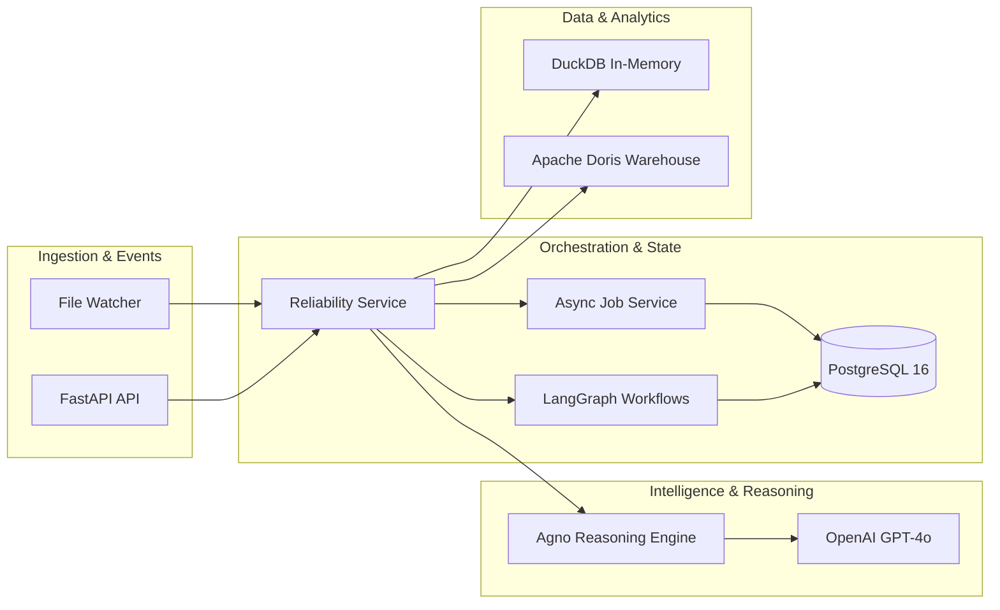

# Architecture

Last updated: 2026-02-18

## System Architecture Overview

### Evaluation Pipeline Flow (Stage Detail)
1. **Stage A (Schema)**: Pydantic/DuckDB alignment.
2. **Stage A2 (Profile)**: In-memory aggregate metrics.
3. **Stage A3 (Score)**: 6D weighted quality framework.
4. **Stage B (Anomaly)**: Multi-detector: z-score, robust MAD, IQR.
5. **Stage C (Decision)**: Forced Load / Automated Routing.
6. **Stage D (Persistence)**: Outcomes (History, Metrics, Baselines, SLOs).
7. **Stage E (Reasoning)**: LLM explanation/advice via Agno.

## Core Runtime Components

- **API Layer (`src/api.py`)**: FastAPI application serving the Next.js dashboard and external integrations.
- **Service Layer (`src/services/`)**:
    - `ReliabilityService`: The primary business logic orchestrator.
    - `AsyncJobService`: PostgreSQL-backed state machine for background tasks (QUEUED -> CLAIMED -> COMPLETED/FAILED). Supports in-process threading or distributed workers via `ASYNC_JOB_EXECUTION_MODE`.
    - `IncidentService`: Manages lifecycle events (`OPEN`, `ACK`, `RESOLVED`) and alerting.
    - `PolicyService`: Evaluates safety rules for destructive actions (e.g., deleting a "CRITICAL" dataset requires explicit human approval).
    - `ActionAuditService`: SQL-backed immutable log for every system or human action.
- **Agentic Core (`src/agents/monitor_agent.py`)**: High-level orchestrator that manages the transition between deterministic stages and AI-driven reasoning.
- **Workflow Runtimes (`src/workflows/`)**:
    - `HITLContractWorkflow`: LangGraph workflow managing the "Missing Contract" state with durable checkpoints.
    - `AgenticReliabilityWorkflow`: Investigates data failures and proposes remediation plans.
- **Tools Engine (`src/tools/`)**:
    - `DimensionScorer`: Implements a 6-dimensional quality model (Reliability, Completeness, etc.) with configurable weights.
    - `AnomalyDetector`: Statistical engine for seasonality-aware drift detection.
    - `ImpactAnalyzer`: Builds a dependency graph from `lineage.yaml` to assess downstream risk.

## Decisioning & Quality Gates

### Quality Gates (Stage C)
The platform evaluates the final `verdict` based on:
1. **Schema Consistency**: Hard block if mandatory columns are missing or types are incompatible.
2. **Dimension Scores**: Calculated against the 6D framework.
3. **Anomaly Counts**: Aggregated z-score violations.

**Manual Force Load**:
Operators can manually override a `BLOCKED` or `WARNING` status using the `force_load` flag.
- **Behavior**: Bypasses Stage C load block and forces ingestion into Doris.
- **Auditing**: Prefixes the verdict reason with `FORCE LOAD:` and records the action in the `action_audit` table.

### Anomaly Detection Logic
The detector uses three concurrent models to reduce false positives:
- **Z-Score**: Best for normal distributions.
- **Robust MAD**: Resilient to outliers (Median Absolute Deviation).
- **IQR (Inter-Quartile Range)**: Effective for non-parametric data.

## Data Persistence Strategy

- **PostgreSQL 16**: The source of truth for all operational state.
    - `run_history`: Summarized run outcomes.
    - `metric_history`: JSONB time-series of every profile metric.
    - `learned_thresholds`: Rolling baselines for anomaly detection.
    - `async_jobs`: Durable queue status.
- **DuckDB**: Used for fast, zero-copy profiling of CSV/Parquet/JSON files in memory before persistence.
- **File System**: `config/expectations` holds the YAML contracts (Data Contract standard).

## Tech Stack Summary

- **Backend**: Python 3.12, FastAPI, Pydantic v2.
- **AI/LLM**: Agno Framework, OpenAI (GPT-4o), LangGraph (Orchestration).
- **Data Engine**: DuckDB, Pandas, PyMySQL (Doris Load).
- **Frontend**: Next.js 15, Tailwind CSS, Lucide Icons, Shadcn-like component architecture (Vanilla CSS/Tailwind mixed).
- **Observability**: SLACK webhooks, LangSmith tracing, structured JSON logging.

## Related Docs

- `docs/api.md`: Request/Response reference.
- `docs/database.md`: Schema definitions.
- `docs/connectors.md`: Source ingestion guide.
